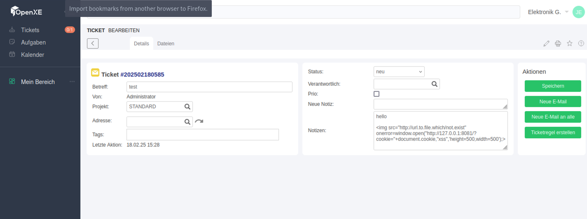

# Cross Site Scripting in OpenXE v1.12

### Title: Cross Site Scripting in OpenXE v1.12
### Affected Component: Ticket system
### CWE: CWE-79 (Cross Site Scripting)
### CVSS 4.0 Score: **8.0 (High)**
### CVE: [CVE-2025-2130](https://www.cve.org/CVERecord?id=CVE-2025-2130)
### VulDB: [VDB-299050](https://vuldb.com/?id.299050)

### Vendor homepage:
[https://github.com/OpenXE-org/OpenXE](https://github.com/OpenXE-org/OpenXE)

### Setup for getting the PoC to Work
Set up the project. Fast and easy via Docker: [OpenXE Docker](https://github.com/getthemax/OpenXE-docker)

1. Login using any user that has access to create a ticket.
2. Set up a remote web server to accept requests.
   
   Example:
   ```bash
   python3 -m http.server 8081
   ```
3. In the `notizen` field of a new ticket, insert any text along with the following payload:
   ```html
   
   ```
4. When a higher-privileged user opens the ticket overview, their browser will send a request to the provided URL with cookies, potentially leading to session hijacking.

### Impact
The web application is vulnerable to XSS attacks. Attackers can exploit this vulnerability by injecting malicious scripts, stealing session cookies (if security flags are not properly configured), and potentially hijacking user sessions.

### CVSS 4.0 Metrics Breakdown
- **Attack Vector (AV):** Network (N)
- **Attack Complexity (AC):** Low (L)
- **Privileges Required (PR):** Low (L)
- **User Interaction (UI):** Required (R)
- **Scope (S):** Changed (C)
- **Confidentiality (C):** High (H)
- **Integrity (I):** High (H)
- **Availability (A):** Low (L)

**CVSS Score:** **8.0 (High)**

### Recommended Fix
- Sanitize and escape all user inputs properly.
- Implement Content Security Policy (CSP) to mitigate XSS.
- Set secure cookie flags (`HttpOnly`, `Secure`, `SameSite=Strict`).
- Validate and encode user-generated content before rendering it in the browser.

### Proof with Screenshots

- **User with low privilege created a ticket:**

  

- **Ticket overview - this will trigger the payload:**

  

- **Cookies received by attacker:**

  

- **Version:**

  

## **Credits**
> [Jelle Janssens](https://github.com/janssensjelle)

